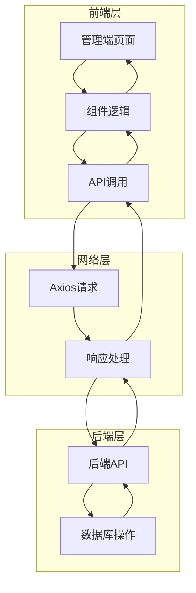

# 管理端数据流图

## 整体架构



## 详细数据流

### 1. 用户管理模块数据流

```mermaid
flowchart TD
    A[用户管理页面] --> B[页面加载]
    B --> C[调用queryPageApi]
    C --> D[Axios GET /admin/users]
    D --> E[后端返回用户列表]
    E --> F[更新tableData]
    F --> A
    
    A --> G[搜索/分页]
    G --> C
    
    A --> H[点击添加用户]
    H --> I[打开对话框]
    I --> J[填写表单]
    J --> K[点击保存]
    K --> L[调用addApi]
    L --> M[Axios POST /admin/users]
    M --> N[后端处理]
    N --> O[返回结果]
    O --> P[显示提示]
    P --> C
    
    A --> Q[点击编辑用户]
    Q --> R[调用queryInfoApi]
    R --> S[Axios GET /admin/users/{id}]
    S --> T[后端返回用户信息]
    T --> U[填充表单]
    U --> I
    J --> V[调用updateApi]
    V --> W[Axios PUT /admin/users]
    W --> N
    
    A --> X[点击删除用户]
    X --> Y[确认对话框]
    Y --> Z[调用deleteApi]
    Z --> AA[Axios DELETE /admin/users/{id}]
    AA --> N
    
    A --> AB[点击启用/禁用]
    AB --> AC[调用updateStatusApi]
    AC --> AD[Axios POST /admin/users/{id}/status]
    AD --> N
```

### 2. 其他管理模块数据流

其他管理模块（案例管理、法律类型管理、法律书管理、法律条文管理）的数据流与用户管理模块类似，主要区别在于API接口和数据结构。

## 数据流关键点

1. **数据获取流程**：
   - 页面加载时调用分页查询API
   - 搜索条件变化时重新查询
   - 分页参数变化时重新查询

2. **数据操作流程**：
   - 新增：填写表单 → 调用POST API → 刷新列表
   - 修改：获取详情 → 填写表单 → 调用PUT API → 刷新列表
   - 删除：确认对话框 → 调用DELETE API → 刷新列表
   - 状态更新：调用状态更新API → 刷新列表

3. **技术实现**：
   - 使用Vue 3 Composition API管理响应式数据
   - 使用Element Plus作为UI组件库
   - 使用Axios进行HTTP请求
   - 统一的API调用方式和错误处理

4. **状态管理**：
   - 使用localStorage存储登录用户信息
   - 组件内部使用ref管理响应式数据
   - 页面状态通过路由参数和组件内部状态管理

## 代码结构

```
src/
├── api/              # API接口定义
│   ├── user.js       # 用户相关API
│   ├── case.js       # 案例相关API
│   ├── type.js       # 类型相关API
│   ├── law-book.js   # 法律书相关API
│   └── law-article.js # 法律条文相关API
├── utils/
│   └── request.js    # Axios请求配置
└── views/admin/      # 管理端页面
    ├── layout/       # 布局组件
    ├── user/         # 用户管理
    ├── case/         # 案例管理
    ├── type/         # 类型管理
    ├── law-book/     # 法律书管理
    └── law-article/  # 法律条文管理
```

## 数据流特点

1. **单向数据流**：从API获取数据 → 更新组件状态 → 渲染UI → 用户操作 → 调用API → 更新数据
2. **统一的API调用模式**：每个管理模块都采用相似的API调用模式
3. **响应式数据管理**：使用Vue 3的ref和watch管理响应式数据
4. **错误处理**：通过try-catch和Element Plus的消息提示处理错误
5. **用户体验优化**：操作后自动刷新数据，提供加载状态和操作反馈

## 潜在优化点

1. **状态管理**：对于复杂的管理端应用，可以考虑使用Pinia或Vuex进行状态管理
2. **API封装**：可以进一步封装API调用，统一处理错误和加载状态
3. **代码复用**：可以提取共用的表格、表单组件，减少重复代码
4. **权限控制**：可以增加基于角色的权限控制，限制不同用户的操作权限
5. **性能优化**：可以使用虚拟滚动、懒加载等技术优化大数据量的展示