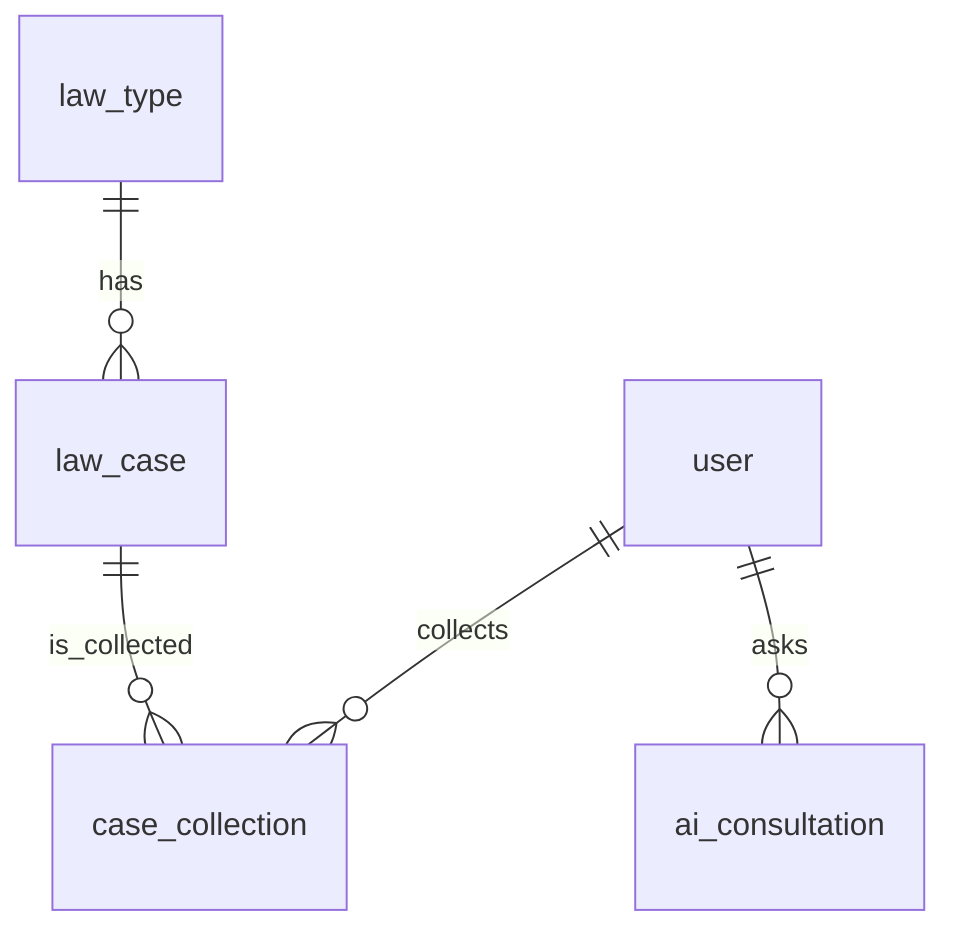

# 法律咨询平台数据库框架设计

## 1. 数据库设计概述

本数据库设计主要围绕法律咨询平台的核心功能展开，包括法律类型管理、法律案例管理、用户管理、案例收藏和AI咨询记录等功能。数据库采用MySQL作为存储引擎，使用InnoDB存储引擎以支持事务和外键约束。

## 2. 数据库表结构

### 2.1 法律类型表（law_type）

| 字段名 | 数据类型 | 约束 | 描述 |
| :--- | :--- | :--- | :--- |
| id | INT(11) | NOT NULL AUTO_INCREMENT PRIMARY KEY | 主键ID |
| name | VARCHAR(50) | NOT NULL UNIQUE | 类型名称 |
| description | VARCHAR(255) | NOT NULL | 类型描述 |
| create_time | DATETIME | NOT NULL DEFAULT CURRENT_TIMESTAMP | 创建时间 |
| update_time | DATETIME | NOT NULL DEFAULT CURRENT_TIMESTAMP ON UPDATE CURRENT_TIMESTAMP | 更新时间 |

**用途**：存储法律类型信息，为法律案例提供分类依据。

### 2.2 法律案例表（law_case）

| 字段名 | 数据类型 | 约束 | 描述 |
| :--- | :--- | :--- | :--- |
| id | INT(11) | NOT NULL AUTO_INCREMENT PRIMARY KEY | 主键ID |
| title | VARCHAR(100) | NOT NULL | 案例标题 |
| type_id | INT(11) | NOT NULL FOREIGN KEY | 法律类型ID |
| tags | VARCHAR(100) | NOT NULL | 标签，多个标签用逗号分隔 |
| content | TEXT | NOT NULL | 案例内容 |
| cover | VARCHAR(255) | DEFAULT NULL | 封面图片URL |
| publish_time | DATETIME | NOT NULL DEFAULT CURRENT_TIMESTAMP | 发布时间 |
| status | TINYINT(1) | NOT NULL DEFAULT 1 | 状态：1-发布，0-下架 |
| create_time | DATETIME | NOT NULL DEFAULT CURRENT_TIMESTAMP | 创建时间 |
| update_time | DATETIME | NOT NULL DEFAULT CURRENT_TIMESTAMP ON UPDATE CURRENT_TIMESTAMP | 更新时间 |

**用途**：存储法律案例信息，包括案例标题、内容、类型、标签等。

### 2.3 用户表（user）

| 字段名 | 数据类型 | 约束 | 描述 |
| :--- | :--- | :--- | :--- |
| id | INT(11) | NOT NULL AUTO_INCREMENT PRIMARY KEY | 主键ID |
| username | VARCHAR(50) | NOT NULL UNIQUE | 用户名 |
| password | VARCHAR(100) | NOT NULL | 密码（加密存储） |
| nickname | VARCHAR(50) | NOT NULL | 昵称 |
| email | VARCHAR(100) | NOT NULL UNIQUE | 邮箱 |
| phone | VARCHAR(20) | NOT NULL UNIQUE | 手机号 |
| role | INT(11) | NOT NULL DEFAULT 0 | 角色：1-管理员，0-普通用户 |
| status | TINYINT(1) | NOT NULL DEFAULT 1 | 状态：1-启用，0-禁用 |
| create_time | DATETIME | NOT NULL DEFAULT CURRENT_TIMESTAMP | 创建时间 |
| update_time | DATETIME | NOT NULL DEFAULT CURRENT_TIMESTAMP ON UPDATE CURRENT_TIMESTAMP | 更新时间 |

**用途**：存储用户信息，包括登录凭证、个人信息和权限角色。

### 2.4 案例收藏表（case_collection）

| 字段名 | 数据类型 | 约束 | 描述 |
| :--- | :--- | :--- | :--- |
| id | INT(11) | NOT NULL AUTO_INCREMENT PRIMARY KEY | 主键ID |
| user_id | INT(11) | NOT NULL FOREIGN KEY | 用户ID |
| case_id | INT(11) | NOT NULL FOREIGN KEY | 案例ID |
| create_time | DATETIME | NOT NULL DEFAULT CURRENT_TIMESTAMP | 收藏时间 |

**用途**：记录用户收藏的法律案例，实现案例收藏功能。

### 2.5 AI咨询记录表（ai_consultation）

| 字段名 | 数据类型 | 约束 | 描述 |
| :--- | :--- | :--- | :--- |
| id | INT(11) | NOT NULL AUTO_INCREMENT PRIMARY KEY | 主键ID |
| user_id | INT(11) | NOT NULL FOREIGN KEY | 用户ID |
| question | TEXT | NOT NULL | 问题 |
| answer | TEXT | NOT NULL | 回答 |
| create_time | DATETIME | NOT NULL DEFAULT CURRENT_TIMESTAMP | 咨询时间 |

**用途**：记录用户与AI法律助手的咨询对话，便于后续分析和参考。

### 2.6 法律条文表（law_article）

| 字段名 | 数据类型 | 约束 | 描述 |
| :--- | :--- | :--- | :--- |
| id | INT(11) | NOT NULL AUTO_INCREMENT PRIMARY KEY | 主键ID |
| book_title | VARCHAR(200) | NOT NULL | 法律书标题 |
| article_title | VARCHAR(200) | NOT NULL | 法律条文标题 |
| content | TEXT | NOT NULL | 条文内容 |
| publish_date | DATE | NOT NULL | 发布日期 |
| effective_date | DATE | NOT NULL | 生效日期 |
| create_time | DATETIME | NOT NULL DEFAULT CURRENT_TIMESTAMP | 创建时间 |
| update_time | DATETIME | NOT NULL DEFAULT CURRENT_TIMESTAMP ON UPDATE CURRENT_TIMESTAMP | 更新时间 |

**用途**：存储法律条文信息，为AI咨询和用户查询提供法律依据。

## 3. 数据库关系图

## 4. 数据库设计特点

1. **逻辑外键**：使用逻辑外键确保数据的完整性和一致性，例如法律案例必须属于某个法律类型，通过应用程序代码来维护引用完整性。

2. **索引优化**：为常用查询字段创建索引，例如法律案例的类型ID和状态字段，提高查询效率。

3. **时间戳管理**：所有表都包含create_time和update_time字段，自动记录数据的创建和更新时间。

4. **安全性**：用户密码使用加密存储，确保用户信息安全。

5. **扩展性**：数据库设计考虑了未来的扩展性，例如可以通过添加字段或表来支持新功能。

## 5. 数据初始化

数据库初始化包括以下内容：

1. **法律类型数据**：初始化民事法律、刑事法律、行政法律等基本法律类型。

2. **用户数据**：初始化管理员账户和测试用户账户。

3. **法律案例数据**：初始化几个典型的法律案例，包括劳动合同纠纷、房产继承纠纷、交通事故赔偿等。

4. **法律条文数据**：初始化民法典、刑法、劳动合同法等基本法律条文。

## 6. 数据库访问层设计

### 6.1 技术选型

- **ORM框架**：使用MyBatis-Plus，简化数据库操作，提高开发效率。
- **连接池**：使用HikariCP，提供高性能的数据库连接管理。
- **事务管理**：使用Spring事务管理，确保数据操作的一致性。

### 6.2 数据访问接口设计

- **法律类型DAO**：提供法律类型的CRUD操作。
- **法律案例DAO**：提供法律案例的CRUD操作，以及分页查询、按类型查询等功能。
- **用户DAO**：提供用户的CRUD操作，以及根据用户名、邮箱、手机号查询等功能。
- **案例收藏DAO**：提供收藏的CRUD操作，以及根据用户ID查询收藏案例等功能。
- **AI咨询记录DAO**：提供咨询记录的CRUD操作，以及根据用户ID查询咨询历史等功能。
- **法律条文DAO**：提供法律条文的CRUD操作，以及根据关键词查询等功能。

## 7. 性能优化策略

1. **索引优化**：为常用查询字段创建适当的索引，例如法律案例的标题、标签等。

2. **分页查询**：使用分页查询减少数据传输量，提高查询效率。

3. **缓存策略**：对热点数据（如法律类型、热门案例）使用Redis缓存，减少数据库查询。

4. **批量操作**：对于批量插入、更新操作，使用批量处理减少数据库交互次数。

5. **SQL优化**：优化SQL语句，避免全表扫描，减少数据库负担。

## 8. 安全考虑

1. **密码加密**：用户密码使用BCrypt等安全的加密算法存储。

2. **SQL注入防护**：使用MyBatis-Plus的参数化查询，防止SQL注入攻击。

3. **权限控制**：实现基于角色的权限控制，确保用户只能访问授权的资源。

4. **数据验证**：对输入数据进行严格验证，防止恶意数据导致的安全问题。

5. **日志记录**：记录关键操作日志，便于审计和问题排查。

## 9. 总结

本数据库设计充分考虑了法律咨询平台的功能需求，提供了完善的数据模型和关系设计。通过合理的表结构设计、索引优化和安全措施，确保了系统的性能和安全性。同时，数据库设计具有良好的扩展性，可以适应未来业务需求的变化。